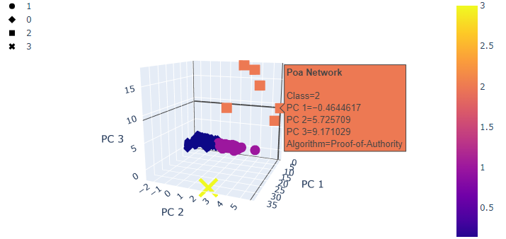

# Cryptocurrencies
Columbia University Data Analyst Bootcamp Module on Unsupervised Learning

## Deliverable 1-4
All tables and code for deliverables can be found in the [crypto_clustering.ipynb](crypto_clustering.ipynb) file.

## Screenshots for Deliverable 4
`hvplot` graphs do not render in the `*.ipynb` files, so I will attach screenshots of the two graphs here.
### 3-D Plot with 4 Clusters

### Scatter Plot with 4 Clusters

